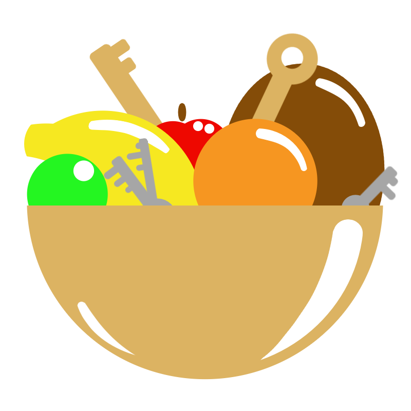

<div id="top"></div>

<br />
<div align="center">
  <a href="https://github.com/Skryvvara/fruitpass">
      
  </a>

  <h3 align="center">Fruitpass</h3>

 <p align="center">
    <br />
    <a href="https://github.com/Skryvvara/fruitpass">Report a Bug☠️</a>
    ·
    <a href="https://github.com/Skryvvara/fruitpass">Request a Feature📝</a>
  </p>
</div>

## About

Fruitpass is a command line utility written in Go to generate password by using a list of adjectives, colours, and fruits and also adds a random number and a special symbol.

The goal was to get password that are easy (or easier) to memorize than long string of random symbols.

## Installation

When building this project you end up with a single binary called fruitpass (on MacOS and Linux) or fruitpass.exe on Windows.

When using MacOS or Linux you can use the Makefile to install the tool into your /usr/local/bin folder. Simply run `make install`. This command could require sudo.

Or install it manually

```
go mod tidy
go build -o bin/fruitpass
cp bin/fruitpass /usr/local/bin/fruitpass
```

# Example usage


# Example usage with base64 encoding


# Special Thanks

## [Ymir](https://twitter.com/ymirbirb)

Drew the awesome logo for Fruitpass. Thank you very much!
